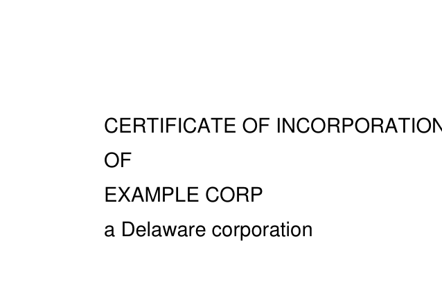

# core


<!-- WARNING: THIS FILE WAS AUTOGENERATED! DO NOT EDIT! -->

fastfitz is a small ergonomic layer over
[PyMuPDF](https://pymupdf.readthedocs.io/) for working with PDFs
interactively – in Jupyter, solveit, or an AI-driven kernel. The design
rule: reach for *text* first (cheap, precise), and for *pixels* only
when layout matters. When you do need pixels, previews should be
searchable and croppable so you render just the region you care about,
not whole pages.

Note that PyMuPDF is AGPL-3.0 licensed, and therefore so is fastfitz.

``` python
from fastcore.test import *
```

## A sample document

We build a small two-page PDF right here, so the demos below are
deterministic and self-contained.

``` python
smpl = fitz.open()
for lines in (['CERTIFICATE OF INCORPORATION','OF','EXAMPLE CORP','a Delaware corporation'],
              ['ARTICLE ONE','The name of the corporation is','Example Corp']):
    pg = smpl.new_page()
    for j,l in enumerate(lines): pg.insert_text((72, 92+24*j), l, fontsize=14)
pg0 = smpl[0]
```

## Text

Most questions about a PDF are answered by its text. `Document.text`
gives the whole document (or chosen pages) in one string, with page
markers so line references stay grounded.

------------------------------------------------------------------------

### Document.text

``` python
def text(
    pages:NoneType=None
)->str:
```

*Plain text of `pages` (default: all), with `--- page N ---` separators*

``` python
t = smpl.text()
assert 'CERTIFICATE OF INCORPORATION' in t and '--- page 1 ---' in t
assert 'ARTICLE ONE' not in smpl.text(pages=[0])
print(t)
```

    --- page 0 ---
    CERTIFICATE OF INCORPORATION
    OF
    EXAMPLE CORP
    a Delaware corporation
    --- page 1 ---
    ARTICLE ONE
    The name of the corporation is
    Example Corp

## Search

`Page.search_for` returns the rects where a string appears; we lift it
to the document level, returning `(page, rects)` pairs for pages with
hits. The rects are the bridge between text and pixels: find something
textually, then render exactly where it lives.

------------------------------------------------------------------------

### Document.search_for

``` python
def search_for(
    q
)->list:
```

*`(page, rects)` for each page where `q` matches; pages without hits are
dropped*

``` python
hits = smpl.search_for('corporation')
test_eq([p.number for p,_ in hits], [0, 1])
test_eq(smpl.search_for('nonexistent'), [])
hits
```

    [(page 0 of <None, doc# 1>,
      [Rect(205.0139923095703, 76.94999694824219, 309.2439880371094, 96.18599700927734),
       Rect(146.6900177001953, 148.9499969482422, 216.71800231933594, 168.18600463867188)]),
     (page 1 of <None, doc# 1>,
      [Rect(177.83999633789062, 100.94999694824219, 247.86798095703125, 120.18599700927734)])]

## Preview

`Page.preview` renders to a PNG `Image` in three modes: the whole page,
a `clip` rect, or – the interesting one – the union of the rects
matching a query `q`. Since `search_for` returns one rect per line, the
union spans line breaks, so a match that wraps still comes back as one
readable crop.

The default `dpi=150` puts a US Letter page at ~1650px on the long edge:
comfortably readable for vision models while staying cheap. Drop it
lower for thumbnails, raise it for fine print.

------------------------------------------------------------------------

### Page.preview

``` python
def preview(
    q:NoneType=None, clip:NoneType=None, dpi:int=150
):
```

*Render as a PNG `Image`: the whole page, a `clip` rect, or the union of
rects matching `q`*

``` python
assert pg0.preview().data[:8] == b'\x89PNG\r\n\x1a\n'
test_fail(lambda: pg0.preview('missing text'), contains='not found')
pg0.preview()
```


The query mode crops to just the matched region:

``` python
pg0.preview('CERTIFICATE OF INCORPORATION')
```


…and an explicit `clip` renders any rect you like:

``` python
pg0.preview(clip=fitz.Rect(0, 0, 306, 200))
```



### Pages display themselves

With a `_repr_png_`, a bare `Page` expression renders visually in any
rich frontend.

``` python
assert pg0._repr_png_()[:8] == b'\x89PNG\r\n\x1a\n'
pg0
```


The idioms compose: search the document, preview the hit.

``` python
p,_ = smpl.search_for('Delaware')[0]
p.preview('Delaware')
```


